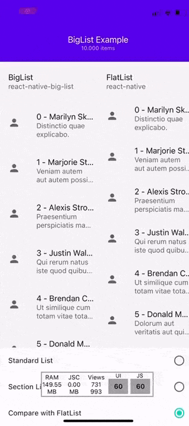
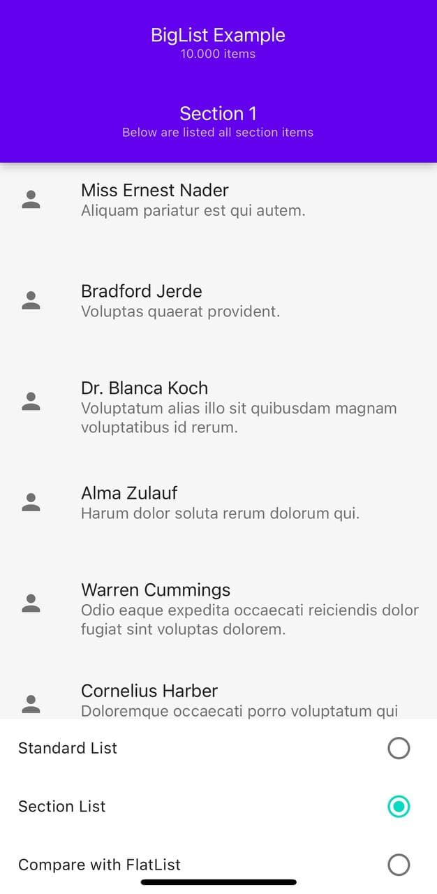

<div align="center">


### If this project has helped you out, please support us with a star 🌟

<br>

[](http://npmjs.org/package/react-native-big-list)
[](https://prettier.io/)
[](http://npmjs.org/package/react-native-big-list)

<!--[](https://packagequality.com/#?package=react-native-big-list)-->

</div>

## 📘 Description

#### What is this?

This is a high performance list view for React Native with support for complex layouts using a similar FlatList usage to make easy the replacement.
This list implementation for big list rendering on React Native works with a recycler focused on performance and memory usage and so it permits processing thousands items on the list.

#### Why another list library?

React Native's FlatList is great but when it comes to big lists it has some flaws because of its item caching.
Exists some alternatives like `react-native-largelist` and `recyclerlistview` but both don't support Expo and have some issues.

The `react-native-largelist` isn't compatible with web and Expo, has native code that sometimes need to be readjusted and maintained, have a weird list item recycles (because it never has blank items), need data restructure and have some issues when trying to process a lot of data (eg: 100,000 items) because it would freeze the CPU.

The `recyclerlistview` is very performant but isn't compatible with Expo. Also suffers from an empty frame on mount, weird scroll positions when trying to scroll to an element on mount, and the implementation of sticky headers conflicts with `Animated`.

#### How it works?

Recycler makes it easy to efficiently display large sets of data. You supply the data and define how each item looks, and the recycler library dynamically creates the elements when they're needed.
As the name implies, the recycler recycles those individual elements. When an item scrolls off the screen, the recycler doesn't destroy its view. Instead, the recycler reuses the view for new items that have scrolled onscreen. This reuse vastly improves performance, improving your app's responsiveness and reducing power consumption.

When list can't render your items fast enough the non-rendered components will appear as blank space.

_Compatible with: Android, iOS, Windows, Web and Expo._

## 📖 Install

Install the library from npm or yarn just running one of the following command lines:

| npm                                        | yarn                             |
| ------------------------------------------ | -------------------------------- |
| `npm install react-native-big-list --save` | `yarn add react-native-big-list` |

## 💻 Usage

#### Standard List (array of items)

```javascript
import BigList from "react-native-big-list";

// ...

// Data array
const data = [
  { label: "1", value: 1 /* ... */ },
  { label: "2", value: 2 /* ... */ },
  { label: "3", value: 3 /* ... */ },
  { label: "4", value: 4 /* ... */ },
  { label: "5", value: 5 /* ... */ },
  // ...
];

// Example
const renderItem = ({ item, index }) => <MyListItem item={item} />;
const renderEmpty = () => <MyEmpty />;
const renderHeader = () => <MyHeader />;
const renderFooter = () => <MyFooter />;

return (
  <BigList
    data={data}
    // Item
    itemHeight={50} // Item height
    renderItem={renderItem}
    // Empty (optional)
    renderEmpty={renderEmpty}
    // Header (optional)
    headerHeight={90} // Header height
    renderHeader={renderHeader}
    // Footer (optional)
    footerHeight={100} // Header footer
    renderFooter={renderFooter}
  />
);
```

#### Section List (array with inside arrays of items)

> This list will auto stick the section rendered on the top of the list

```javascript
import BigList from "react-native-big-list";

// ...

// Data array
const sections = [
  [
    // Section 1
    { label: "1", value: 1 /* ... */ },
    { label: "2", value: 2 /* ... */ },
  ],
  [
    // Section 2
    { label: "3", value: 3 /* ... */ },
    { label: "4", value: 4 /* ... */ },
  ],
  [
    // Section 3
    { label: "6", value: 6 /* ... */ },
    { label: "6", value: 6 /* ... */ },
  ],
  // ...
];

// Example
const renderItem = ({ item, section, row }) => <MyListItem item={item} />;
const renderHeader = () => <MyHeader />;
const renderFooter = () => <MyFooter />;
const renderSectionHeader = () => <MySectionHeader />;
const renderSectionFooter = () => <MySectionFooter />;

return (
  <BigList
    sections={sections}
    // Item
    itemHeight={50} // Item height
    renderItem={renderItem}
    // Header (optional)
    headerHeight={90} // Header height
    renderHeader={renderHeader}
    // Footer (optional)
    footerHeight={100} // Footer footer
    renderFooter={renderFooter}
    // Section (optional)
    sectionHeight={90} // Section header height
    renderSection={renderSectionHeader}
    // Section Footer (optional)
    sectionFooterHeight={100} // Section footer height
    renderSectionFooter={renderSectionFooter}
  />
);
```

For more examples check the `example` directory the `list` directory

## 🎨 Screenshots

| BigList vs FlatList                                          | Section List                                                          |
| ------------------------------------------------------------ | --------------------------------------------------------------------- |
|  |  |

## ⚡️ Example

### Expo

Clone or download repo and after:

```shell
cd Example
yarn install # or npm install
expo start
```

Open Expo Client on your device. Use it to scan the QR code printed by `expo start`. You may have to wait a minute while your project bundles and loads for the first time.

## 💡 Props List

Big list have the same properties of the [ScrollView](https://reactnative.dev/docs/view#props) with some more additional:

| Property                                   | Description                                                                                                                                                  | Type            | Default                                    |
| ------------------------------------------ | ------------------------------------------------------------------------------------------------------------------------------------------------------------ | --------------- | ------------------------------------------ |
| `data`                                     | For simplicity, data is a plain array containing the items to render.                                                                                        | Array           | `[]`                                       |
| `sections`                                 | For simplicity, sections is a plain array containing another plain array with the items (section items) to render. If specified `data` prop will be ignored. | Array           | `[]`                                       |
| `renderItem({ item, index/section, row })` | Takes an item from data and renders it into the list.                                                                                                        | Function        |                                            |
| `renderHeader()`                           | Rendered at the top of all the items.                                                                                                                        | Function        |                                            |
| `renderFooter()`                           | Rendered at the bottom of all the items.                                                                                                                     | Function        |                                            |
| `renderActionSheetScrollViewWrapper()`     | Wrap the entire list into an accessory component.                                                                                                            | Function        |                                            |
| `renderAccessory()`                        | Rendered at the bottom of the list an accessory.                                                                                                             | Function        |                                            |
| `renderEmpty()`                            | Rendered when the list is empty.                                                                                                                             | Function        |                                            |
| `renderSection(section)`                   | Rendered at the top of all the section items.                                                                                                                | Function        |                                            |
| `renderSectionFooter(section)`             | Rendered at the bottom of all the section items.                                                                                                             | Function        |                                            |
| `itemHeight`                               | Specify the item height                                                                                                                                      | Number/Function | `50`                                       |
| `headerHeight`                             | Specify the header height                                                                                                                                    | Number/Function | `0`                                        |
| `footerHeight`                             | Specify the footer height                                                                                                                                    | Number/Function | `0`                                        |
| `sectionHeight`                            | Specify the section height                                                                                                                                   | Number/Function | `0`                                        |
| `sectionFooterHeight`                      | Specify the section footer height                                                                                                                            | Number/Function | `0`                                        |
| `scrollTopValue`                           | Specify the initial scroll from the top of the list                                                                                                          | Number          |                                            |
| `insetTop`                                 | Specify the top inset                                                                                                                                        | Number          | `0`                                        |
| `insetBottom`                              | Specify the bottom inset                                                                                                                                     | Number          | `0`                                        |
| `contentInset`                             | Specify the content inset                                                                                                                                    | Object          | `{ top: 0, right: 0, left: 0, bottom: 0 }` |

## 🤔 How to contribute

Have an idea? Found a bug? Please raise to [ISSUES](https://github.com/marcocesarato/react-native-big-list/issues).
Contributions are welcome and are greatly appreciated! Every little bit helps, and credit will always be given.

<p align="center">
    <br>
    <a href="https://nodei.co/npm/react-native-big-list/" rel="nofollow">
        
    </a>
</p>
